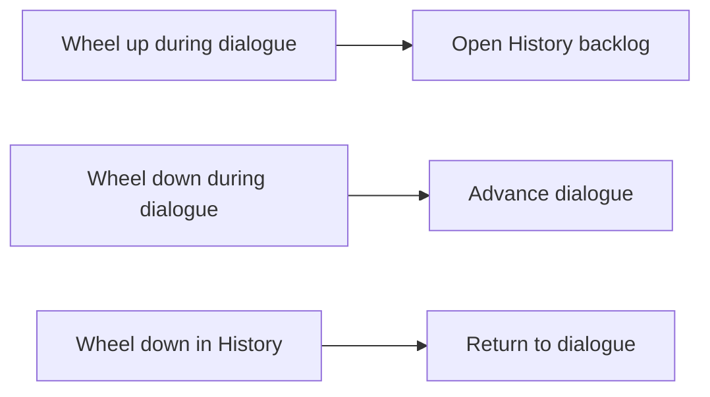

# KirikiriLike - KiriKiri-style UI for Ren'Py

[](https://www.renpy.org/)
[](https://github.com/ThanhNhanGit/KirikiriLike/stargazers)
[](https://github.com/ThanhNhanGit/KirikiriLike/commits/master)

**KirikiriLike** is a drop-in Ren'Py 8 library that adds familiar
[KiriKiri/KAG](https://en.wikipedia.org/wiki/KiriKiri)-style visual novel controls and UI behavior.
Copy one folder into your game to get mouse-wheel dialogue controls, a clean backlog, and
bottom-left character avatars without repeatedly editing `screens.rpy` in every project.

## Features

- **Wheel up opens the dialogue backlog** instead of rolling back.
- **Wheel down advances dialogue**, similar to KiriKiri visual novels.
- **Clean History screen** without Ren'Py's left game-menu navigation or divider.
- **Wheel down closes History** and returns to the live dialogue.
- **Character side-image avatars** follow the currently shown sprite attributes.
- **Reusable configuration namespace** - customize behavior through `kkl.*` settings.
- **Rollback remains available by default** through keyboard/Page Up.
- **No Ren'Py engine patching** and no per-project copy/paste screen edits.

## Quick start

Download this repository and place the folder here:

```text
your-game/
└── game/
    └── KirikiriLike/
        ├── 00_kirikirilike_config.rpy
        ├── 10_kirikirilike_core.rpy
        ├── 20_kirikirilike_wheelnav.rpy
        └── 30_kirikirilike_history.rpy
```

Ren'Py automatically loads `.rpy` files under `game/`; no import statement is required.

For Git users, a submodule keeps the library easy to update:

```bash
git submodule add https://github.com/ThanhNhanGit/KirikiriLike.git game/KirikiriLike
```

## Configure the library

Create `game/kkl_settings.rpy` in your project:

```renpy
init python:
    # Replace "sylvie" with your character's image tag.
    kkl.side_image_tag = "sylvie"

    # These are already True by default; shown for clarity.
    kkl.enable_wheelnav = True
    kkl.history_closes_on_wheeldown = True
```

Set options at the default init priority (`0`) or any priority below `100`. Do not edit the
library files; that keeps upgrades portable between Ren'Py projects.

### Available settings

| Setting | Default | Purpose |
|---|---:|---|
| `kkl.enable_wheelnav` | `True` | Wheel up opens History; wheel down advances dialogue. |
| `kkl.enable_side_image` | `True` | Allows the library to configure `config.side_image_tag`. |
| `kkl.side_image_tag` | `None` | Character image tag used for the bottom-left avatar. |
| `kkl.wheel_up_key` | `"mousedown_4"` | Input that opens the dialogue backlog. |
| `kkl.wheel_down_key` | `"mousedown_5"` | Input that advances dialogue or closes History. |
| `kkl.history_closes_on_wheeldown` | `True` | Returns to the game when scrolling down in History. |
| `kkl.history_use_project_styles` | `True` | Reuses the project's stock History and game-menu styles. |
| `kkl.force_rollback_disabled` | `False` | Completely disables Ren'Py rollback when enabled. |

## Add character side-image avatars

KirikiriLike uses Ren'Py's built-in `SideImage()` system. Your project supplies the character
definition and portrait artwork.

### 1. Give the character an image tag

```renpy
define s = Character("Sylvie", image_tag="sylvie")
```

### 2. Define side images matching sprite attributes

```renpy
image side sylvie green normal = "images/side/side sylvie green normal.png"
image side sylvie green smile = "images/side/side sylvie green smile.png"
image side sylvie green surprised = "images/side/side sylvie green surprised.png"
```

### 3. Select the tag

```renpy
init python:
    kkl.side_image_tag = "sylvie"
```

The avatar now updates whenever the shown `sylvie` sprite changes attributes. If no matching
`side sylvie ...` image exists, Ren'Py displays no avatar and does not raise an error.

To change avatar placement, adjust your project's `say` screen:

```renpy
add SideImage() xalign 0.0 xoffset 20 yalign 1.0 yoffset -20
```

## How the mouse-wheel behavior works



The wheel-up binding lives in an always-on overlay and captures the event before Ren'Py's default
rollback handler. The History screen owns its wheel-down exit binding because normal overlay screens
are suppressed while a menu is open.

## Compatibility

- Designed for **Ren'Py 8.x** projects using the standard screen architecture.
- Projects with heavily customized History styles can set
  `kkl.history_use_project_styles = False` to use the bundled fallback styles.
- Mobile variants do not use mouse-wheel navigation; side-image behavior still follows the
  project's `say` screen and variant rules.

## Troubleshooting

### The avatar does not appear

Check all three requirements:

1. The `Character` has `image_tag="..."`.
2. A matching `image side <tag> <attributes>` exists.
3. `kkl.side_image_tag` uses the same tag.

Restart Ren'Py after adding new image files so the image scanner can discover them, or define the
images explicitly as shown above.

### Wheel up still performs rollback

Confirm `kkl.enable_wheelnav` is `True` and that another high-z-order screen is not capturing
`mousedown_4` first.

### Restore Ren'Py's stock History screen

Remove `30_kirikirilike_history.rpy`. The remaining wheel and side-image features can stay installed.

## Project files

| File | Init priority | Purpose |
|---|---:|---|
| `00_kirikirilike_config.rpy` | `-100` / `-1` | Declares the `kkl` namespace and defaults. |
| `10_kirikirilike_core.rpy` | `100` | Configures side images and optional rollback disabling. |
| `20_kirikirilike_wheelnav.rpy` | `150` | Captures wheel-up and adds wheel-down dialogue advance. |
| `30_kirikirilike_history.rpy` | `999` | Replaces the stock History screen with a clean backlog. |

## Testing

This library was linted and exercised with Ren'Py 8.5 native testcases. The tests covered dialogue
advance, History return behavior, navigation removal, and side-image resolution. Real background
mouse-wheel events were also checked without activating the game window.

For reusable Ren'Py linting, route tests, UI assertions, and screenshot regression, see
[test-renpy-vn](https://github.com/ThanhNhanGit/test-renpy-vn).

## Contributing

Bug reports and compatibility notes are welcome in
[GitHub Issues](https://github.com/ThanhNhanGit/KirikiriLike/issues). Please include your Ren'Py
version, platform, relevant `kkl` settings, and a minimal reproduction when possible.

## Related documentation

- [Ren'Py side images](https://www.renpy.org/doc/html/side_image.html)
- [Ren'Py dialogue history](https://www.renpy.org/doc/html/history.html)
- [Ren'Py screen language](https://www.renpy.org/doc/html/screens.html)
