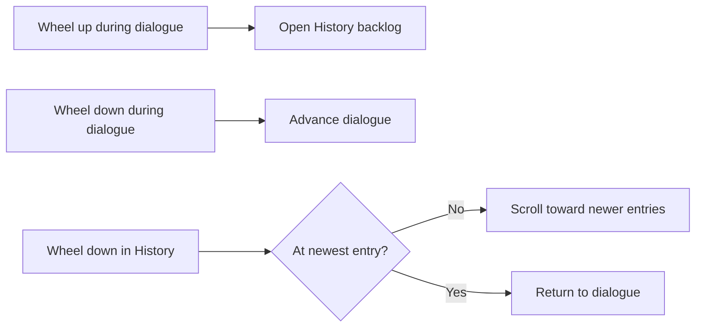

# KirikiriLike - KiriKiri-style UI for Ren'Py

[](https://www.renpy.org/)
[](LICENSE)
[](https://github.com/ThanhNhanGit/KirikiriLike/stargazers)
[](https://github.com/ThanhNhanGit/KirikiriLike/commits/master)

**KirikiriLike** is a drop-in Ren'Py 8 library that adds familiar
[KiriKiri/KAG](https://en.wikipedia.org/wiki/KiriKiri)-style visual novel controls and UI behavior.
Copy one folder into your game to get mouse-wheel dialogue controls, a clean backlog, and
bottom-left character avatars without repeatedly editing `screens.rpy` in every project.

KirikiriLike is an independent community project. It is not affiliated with, sponsored by, or
endorsed by the KiriKiri/KAG project or the Ren'Py project. The KiriKiri and KAG names describe UI
inspiration only; no KiriKiri/KAG source code or assets are included.

## Features

- **Wheel up opens the dialogue backlog** instead of rolling back.
- **Wheel down advances dialogue**, similar to KiriKiri visual novels.
- **Clean History screen** without Ren'Py's left game-menu navigation or divider.
- **Wheel down scrolls History toward the newest entry**, then returns to the live dialogue at the bottom.
- **Character side-image avatars** follow the currently shown sprite attributes.
- **Optional glass-gradient textbox template** with bundled Nunito dialogue fonts.
- **Reusable configuration namespace** - customize behavior through `kkl.*` settings.
- **Rollback remains available by default** through keyboard/Page Up.
- **No Ren'Py engine patching** and no per-project copy/paste screen edits.

## Quick start

Download this repository and place the folder here:

```text
your-game/
└── game/
    └── KirikiriLike/
        ├── 00_kirikirilike_config.rpy
        ├── 10_kirikirilike_core.rpy
        ├── 20_kirikirilike_wheelnav.rpy
        ├── 30_kirikirilike_history.rpy
        ├── 40_kirikirilike_textbox.rpy
        ├── fonts/
        └── gui/
```

Ren'Py automatically loads `.rpy` files under `game/`; no import statement is required.

For Git users, a submodule keeps the library easy to update:

```bash
git submodule add https://github.com/ThanhNhanGit/KirikiriLike.git game/KirikiriLike
```

## Configure the library

Create `game/kkl_settings.rpy` in your project:

```renpy
init python:
    # These are already True by default; shown for clarity.
    kkl.enable_wheelnav = True
    kkl.history_closes_on_wheeldown = True

    # Optional: translucent bottom gradient + Nunito dialogue text.
    kkl.enable_textbox_template = True
```

Set options at the default init priority (`0`) or any priority below `100`. Do not edit the
library files; that keeps upgrades portable between Ren'Py projects.

### Available settings

| Setting | Default | Purpose |
|---|---:|---|
| `kkl.enable_wheelnav` | `True` | Wheel up opens History; wheel down advances dialogue. |
| `kkl.enable_side_image` | `True` | Allows the optional fixed-tag side-image override. |
| `kkl.enable_textbox_template` | `False` | Applies the bundled glass-gradient textbox and Nunito styles. |
| `kkl.side_image_tag` | `None` | Leave `None` for speaker-aware avatars; set a tag only to pin one portrait across every line. |
| `kkl.wheel_up_key` | `"mousedown_4"` | Input that opens the dialogue backlog. |
| `kkl.wheel_down_key` | `"mousedown_5"` | Input that advances dialogue or closes History. |
| `kkl.history_closes_on_wheeldown` | `True` | Returns to the game when scrolling down at the newest History entry. |
| `kkl.history_use_project_styles` | `True` | Reuses the project's stock History and game-menu styles. |
| `kkl.textbox_background` | bundled SVG | Resolution-independent textbox gradient image or displayable. |
| `kkl.textbox_feather_edges` | `True` | Softly fades all four panel edges and corners. |
| `kkl.textbox_background_opacity` | `1.0` | Multiplier for the gradient panel opacity. |
| `kkl.textbox_font` | Nunito Regular | Dialogue font path or `FontGroup`. |
| `kkl.textbox_name_font` | Nunito SemiBold | Speaker-name font path or `FontGroup`. |
| `kkl.textbox_text_color` | `"#f7f9fc"` | Dialogue text color. |
| `kkl.textbox_name_color` | `"#ffffff"` | Default speaker-name color; a Character color can still override it. |
| `kkl.textbox_text_outlines` | subtle shadow + 1px edge | Dialogue depth and readability without letter bloat. |
| `kkl.textbox_name_outlines` | subtle shadow + 1px edge | Speaker-name depth and readability without letter bloat. |
| `kkl.textbox_namebox_background` | `None` | Namebox background; `None` removes the separate plaque. |
| `kkl.textbox_on_small` | `True` | Applies the template to small/mobile variants too. |
| `kkl.force_rollback_disabled` | `False` | Completely disables Ren'Py rollback when enabled. |

## Enable the glass-gradient textbox template

The textbox style is opt-in so adding KirikiriLike to an existing game does not unexpectedly
replace its art direction. Enable it in your project settings:

```renpy
init python:
    kkl.enable_textbox_template = True
```

The template keeps the project's existing textbox height, dialogue position, and text width. It
changes the standard say-window background to a visible translucent panel with softly feathered
edges and a smooth top-to-bottom gradient; applies Nunito Regular to dialogue and SemiBold to
speaker names; removes the separate name plaque; and adds a visible but restrained two-pixel
downward shadow behind a thin centered edge without distorting the letter shapes.

The SVG gradient and its horizontal/vertical alpha masks are stretched by Ren'Py's `Frame`
displayable to the actual textbox allocation. Multiplying both masks feathers all four sides and
the corners, so the panel has no square boundary. The left, right, and bottom masks remain partly
visible at the viewport boundary, allowing their falloff to continue beyond the clipped screen
instead of leaving transparent gutters. It scales consistently when a project changes resolution
or textbox height; no hard-coded `1280x720` layout is required.

Customize only the parts you need:

```renpy
init python:
    kkl.enable_textbox_template = True
    kkl.textbox_background_opacity = 0.85
    kkl.textbox_text_color = "#ffffff"
    kkl.textbox_text_outlines = [(0, "#00000066", 0, 2), (1, "#000000c0", 0, 0)]
    kkl.textbox_namebox_background = Frame("gui/my_namebox.png", 12, 12)
```

Each outline layer uses Ren'Py's `(thickness, color, x_offset, y_offset)` format. A thickness of
`0` creates the shadow from the original glyph without expanding it. The default 2px offset lets
the shadow extend one pixel past the centered 1px edge; set either outline list to `[]` to remove
all text effects.

The font settings also accept a Ren'Py `FontGroup`, which is useful when a translation needs
glyphs outside Nunito's coverage. If a bundled font or gradient file is unavailable, the
template falls back to `DejaVuSans.ttf` and a translucent solid background instead of failing
at startup.

## Add character side-image avatars

KirikiriLike uses Ren'Py's built-in `SideImage()` system. Your project supplies the character
definition and portrait artwork.

### 1. Give the character an image tag

```renpy
define s = Character("Sylvie", image="sylvie")
```

### 2. Define side images matching sprite attributes

```renpy
image side sylvie green normal = "images/side/side sylvie green normal.png"
image side sylvie green smile = "images/side/side sylvie green smile.png"
image side sylvie green surprised = "images/side/side sylvie green surprised.png"
```

That is all the configuration needed. Keep `kkl.side_image_tag = None` (the default).
The avatar follows Sylvie's shown attributes only while `s` is speaking, and narration or a
different character has no Sylvie avatar. If no matching `side sylvie ...` image exists, Ren'Py
displays no avatar and does not raise an error.

Setting `kkl.side_image_tag = "sylvie"` is an advanced fixed-tag override. It deliberately follows
Sylvie's shown sprite on every line, including narration, so it should not be used for normal
speaker portraits.

Ren'Py's stock `say` screen may inset the avatar with `xoffset 20` and
`yoffset -20`. To place the avatar flush against the lower-left screen border,
remove those offsets:

```renpy
add SideImage() xalign 0.0 yalign 1.0
```

## How the mouse-wheel behavior works



The wheel-up binding lives in an always-on overlay and captures the event before Ren'Py's default
rollback handler. The History screen owns its wheel-down behavior because normal overlay screens
are suppressed while a menu is open; it scrolls while newer entries remain and exits only at the
bottom.

## Compatibility

- Designed for **Ren'Py 8.x** projects using the standard screen architecture.
- The textbox template targets the standard `window`, `namebox`, `say_dialogue`,
  `say_thought`, and `say_label` styles. Custom Character style names or a custom say screen
  must inherit or use those styles to receive the template.
- Projects with heavily customized History styles can set
  `kkl.history_use_project_styles = False` to use the bundled fallback styles.
- Mobile variants do not use mouse-wheel navigation; side-image behavior still follows the
  project's `say` screen and variant rules.

## Troubleshooting

### The avatar does not appear

Check these requirements:

1. The `Character` has `image="..."`.
2. A matching `image side <tag> <attributes>` exists.
3. `kkl.side_image_tag` remains `None` for speaker-aware behavior.

Restart Ren'Py after adding new image files so the image scanner can discover them, or define the
images explicitly as shown above.

### Wheel up still performs rollback

Confirm `kkl.enable_wheelnav` is `True` and that another high-z-order screen is not capturing
`mousedown_4` first.

### Restore Ren'Py's stock History screen

Remove `30_kirikirilike_history.rpy`. The remaining wheel and side-image features can stay installed.

### Restore the project's original textbox

Set `kkl.enable_textbox_template = False` or remove `40_kirikirilike_textbox.rpy`. Because the
feature does not replace `screen say`, no screen code needs to be restored.

## Project files

| File | Init priority | Purpose |
|---|---:|---|
| `00_kirikirilike_config.rpy` | `-100` / `-1` | Declares the `kkl` namespace and defaults. |
| `10_kirikirilike_core.rpy` | `100` | Configures side images and optional rollback disabling. |
| `20_kirikirilike_wheelnav.rpy` | `150` | Captures wheel-up and adds wheel-down dialogue advance. |
| `30_kirikirilike_history.rpy` | `999` | Replaces the stock History screen with a clean backlog. |
| `40_kirikirilike_textbox.rpy` | `105` / `110` | Applies the optional gradient and textbox typography styles. |

## Testing

This library was linted and exercised with Ren'Py 8.5 native testcases. The tests covered dialogue
advance, History return behavior, navigation removal, side-image resolution, font application,
and the textbox gradient's alpha profile. Real background mouse-wheel events were also checked
without activating the game window.

For reusable Ren'Py linting, route tests, UI assertions, and screenshot regression, see
[test-renpy-vn](https://github.com/ThanhNhanGit/test-renpy-vn).

## Contributing

Bug reports and compatibility notes are welcome in
[GitHub Issues](https://github.com/ThanhNhanGit/KirikiriLike/issues). Please include your Ren'Py
version, platform, relevant `kkl` settings, and a minimal reproduction when possible.

## License and attribution

KirikiriLike is released under the [MIT License](LICENSE). The History implementation adapts the
structure of Ren'Py's MIT-licensed stock History screen. The bundled Nunito files remain
under the SIL Open Font License 1.1. See
[THIRD_PARTY_NOTICES.md](THIRD_PARTY_NOTICES.md) for the preserved Ren'Py permission notice and
font attribution, permission notices, and project-name disclosures.

## Related documentation

- [Ren'Py side images](https://www.renpy.org/doc/html/side_image.html)
- [Ren'Py dialogue history](https://www.renpy.org/doc/html/history.html)
- [Ren'Py screen language](https://www.renpy.org/doc/html/screens.html)
